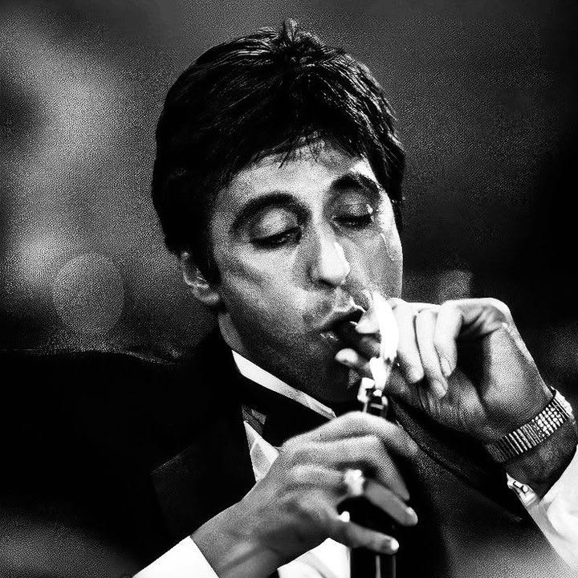

   
   

 

  

     
  

  <!-- 👆 Path ini nunjuk ke assets/profile-photo.jpg di repo rafliprasaka/rafliprasaka. Pastikan nama file foto yang kamu upload persis sama: profile-photo.jpg -->

  

     
  

 

 
